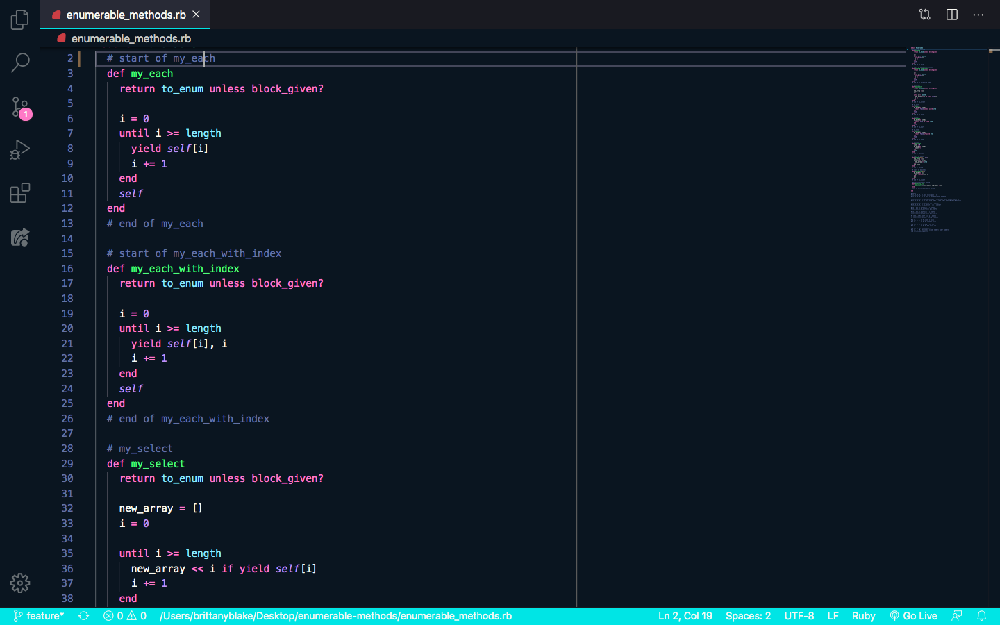

# enumerable-methods

In this project, I was required to rebuild a few popular iterator methods. The project specifications were to:
-Create #my_each, a method that is identical to #each but does not use #each. 
-Create #my_each_with_index in the same way.
-Create #my_select in the same way (you may use #my_each in your definition but not #each).
-Create #my_all? in the same way.
-Create #my_any? in the same way.
-Create #my_none? in the same way.
-Create #my_count in the same way. 
-Create #my_map in the same way. 
-Create #my_inject in the same way.
-Test the #my_inject by creating a method called #multiply_els which multiplies all the elements of the array together by using #my_inject.
-Modify your #my_map method to take either a proc or a block. It won’t be necessary to apply both a proc and a block in the same #my_map call since you could get the same effect by chaining together one #my_map call with the block and one with the proc. This approach is also clearer, since the user doesn’t have to remember whether the proc or block will be run first. So if both a proc and a block are given, only execute the proc.

## Authors

👤 **Brittany Blake**

- Github: [@BrittanyBlake](https://github.com/BrittanyBlake)
- Twitter: [@bbcodes_](https://twitter.com/bbcodes_)
- Linkedin: [Brittany Blake](https://www.linkedin.com/in/brittany-blake-843951109/)

## 🤝 Contributing

Contributions, issues and feature requests are welcome!

- Forking the project
- Cloning the project to your local machine
- `cd` into the project directory
- Run `git checkout -b your-branch-name`
- Make your contributions
- Push your branch up to your forked repository
- Open a Pull Request with a detailed description to the development branch of the original project for a review

## Show your support

Give a ⭐️ if you like this project!

## 📝 License

This project is [MIT](lic.url) licensed.

